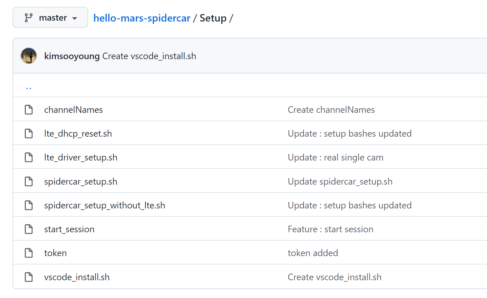

# Jetpack에 필요한 소프트웨어 설치하기

# 🏎️ SpiderCar Prerequisite Install

---

> SpiderCar를 구동시키기 위해 필요한 종속성 소프트웨어들을 설치해 봅시다.
> 

> **하드웨어 관련 소프트웨어**
> 
> - jetson-fan-ctrl (냉각 팬 구동)
> - Swapfile (GPU 여유공간 확보)
> - LTE Module Setup (wifi 모델은 굳이 작업하지 않아도 됨)
> 
>  **Spider 연결 비롯 기능성 소프트웨어**
> 
> - ffmpeg-4.2.2 설치 및 빌드
> - RTCBot
> - 기타 Python Packages

위 내용들이 작업되기 전, 다음과 같은 사항들을 확인해야 합니다. 

- 파이썬 버전
- cv2 설치 여부
- cv2의 FFMPEG 및 Gstreamer 연동 여부

```python
$ python3
Python 3.6.9 (default, Jan 26 2021, 15:33:00)
[GCC 8.4.0] on linux
Type "help", "copyright", "credits" or "license" for more information.
>>> import cv2
>>> print(cv2.getBuildInformation())
  ...
  Video I/O:
    DC1394:                      NO
    **FFMPEG:                      YES**
      avcodec:                   YES (58.54.100)
      avformat:                  YES (58.29.100)
      avutil:                    YES (56.31.100)
      swscale:                   YES (5.5.100)
      avresample:                YES (3.7.0)
    **GStreamer:                   YES (1.14.5)**
    v4l/v4l2:                    YES (linux/videodev2.h)
  ...
>>> 
```

<aside>
💡 Jetpack을 사용한다면 초기에 모두 설정되어 있으니 굳이 작업할 것은 없습니다.

</aside>

아래 과정을 진행해주세요.

```bash
$ git clone https://github.com/teamgrit-lab/hello-mars-spidercar.git
$ cd hello-mars-spidercar
$ cd Setup

# LTE 모델의 경우
$ spidercar_setup.sh

# Wifi 모델의 경우
$ spidercar_setup_without_lte.sh

# LTE 모뎀 설정 후 드라이버 설치 및 필요 작업 확인
# 아래 작업이 정상적으로 완료되지 않는다면 SIM 카드 설정이 잘못되었거나 연결이 잘 안된 것입니다.
$ lte_driver_setup.sh 

# LTE 모듈 세팅이 완료된 이후 dhcp 설정이 1회 추가로 필요합니다. 
$ lte_dhcp_reset.sh 
```

<aside>
🌐  설치를 위하여 인터넷 연결을 반드시 확인해주시기 바랍니다.

</aside>

<aside>
🌐  LTE 모델의 경우 SIM 카드를 삽입하여 세팅을 미리 해주셔야 합니다.

</aside>

<aside>
🌐 설치에는 약 30-40분 정도가 소요됩니다.

</aside>

<aside>
🌐 설치 도중 인터넷 연결 불안정 등으로 중지되었을 경우, 다시 스크립트를 실행하면 됩니다.

</aside>

## ⚙️ Setup 폴더 스크립트들 설명

---

Setup 폴더 내에는 방금 전 언급된 `spidercar_setup.sh` / `spidercar_setup_without_lte.sh`를 비롯하여 여러 설치 스크립트들이 위치하고 있습니다. 

모두 자주 활용되는 기능이기에 작성한 것이며, 이들에 대한 설명을 드리겠습니다.

- `channelNames` : Spider 채널명 MarsRacing 1~20까지의 채널 코드가 적혀있습니다.
- `lte_dhcp_reset.sh` : SIM 카드가 변경된 경우, 해당 스크립트를 사용하여 dhcp 설정을 갱신합니다.
- `lte_driver_setup.sh` : 종종 LTE 셋업에 오류가 발생하는 경우가 있습니다. 이를 위해 LTE 관련 셋업만을 따로 빼둔 실행 스크립트입니다.
- `spidercar_setup.sh` / `spidercar_setup_without_lte.sh` : 생략
- `start_session` : 부팅 시 자동으로 SpiderCar를 실행하게 하기 위한 설정이 담겨 있습니다. 구체적인 내용은 상위 페이지에서 확인하시기 바랍니다.
- [`vscode_install.sh`](https://github.com/teamgrit-lab/hello-mars-spidercar/blob/master/Setup/vscode_install.sh)  : vscode 설치를 위한 스트립트입니다.
- `token` : 현재 이 Repo는 Private 권한을 갖고 있기에 Github 계정 token 인증이 있어야 clone이 가능합니다. 해당 내용을 담은 저만의 메모입니다.


<p align="center">
    
</p>