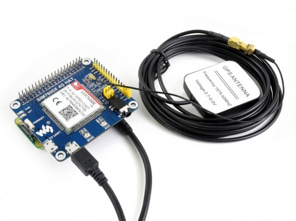

# LTE 모듈 - SIM7600 4G HAT

> **다음과 같은 Jetson Nano & RPi 용 LTE 모듈의 설정을 진행합니다.**

<p align="center">
    
</p>

[SIM7600CE-T/E-H/A-H/SA-H/G-H 4G Modules](https://www.waveshare.com/wiki/SIM7600E-H_4G_HAT)

## 📢 SBC와 연결

---

해당 모듈은 다음과 같은 형태로 **라즈베리파이와 젯슨 나노 모두에서 사용 가능**한 장점을 갖고 있습니다.

<p align="center">
    
</p>

<aside>
💡 대신, 연결법의 차이가 있으니 아래 그림을 참고하세요!

</aside>

## 📢 자동 시작을 위한 Short 설정

---

<p align="center">
    
</p>

본 모듈은 본디 파워 버튼 10초간 눌러야 비로소 Network 전원이 켜집니다. 

이와 같은 번거로움을 덜어내고 자동 시작을 실행하기 위해선 사진과 같이 두 부분의 단락이 필요합니다. 

## 📢 모듈 드라이버 설치

---

- 윈도우에서 모듈 드라이버를 설치하며, 이 과정은 다음 링크에 잘 정리되어 있습니다.

[botletics/SIM7000-LTE-Shield](https://github.com/botletics/SIM7000-LTE-Shield/wiki/USB-Drivers)

[botletics/SIM7000-LTE-Shield](https://github.com/botletics/SIM7000-LTE-Shield/tree/master/SIM7000%20Documentation/Drivers)


<p align="center">
    
</p>

<aside>
💡 윈도우 10용 드라이버는 없지만 8 드라이버도 정상적으로 동작하니 대체하면 됩니다.

</aside>

> 디바이스 드라이버는 다음과 같이 설치합니다.
> 
- **장치 관리자**로 이동하여 **드라이버 업데이트**를 선택하고

<p align="center">
    
</p>

- **컴퓨터에서 드라이버 찾아보기** ⇒ **윈도우 8용 드라이버를 선택** 후 업데이트 합니다.

<p align="center">
    
</p>

- 4개의 포트가 있기 때문에, **위 과정을 4번 반복**하여 최종 아래와 같은 결과를 얻을 수 있습니다.

SIM7600X 4G HAT에는 다음과 같이 **2개의 USB 포트**가 부착되어 있습니다.

이들을 각각 연결한 뒤 하나씩 선택하여 차례대로 드라이버 업데이트를 실행하면 되며, 각각의 포트를 연결한 모습을 하단에 남겨두겠습니다.

- **상단 UART 포트 연결 모습**

<p align="center">
    
</p>

<p align="center">
    
</p>

- **하단 USB 포트 연결 모습**

<p align="center">
    
</p>

<p align="center">
    
</p>

우리가 사용할 포트는 COM3 AT Port입니다.

<aside>
💡 참고로 GPS를 사용하고자 하는 경우는 **COM5 NMEA**를 사용합니다.

</aside>

## 📢 AT Command Tester 설치 및 세팅

이제 사용하는 SIM 카드에 맞추어 APN 설정을 진행하는데요.

우리는 **AT Command**를 사용하여 이러한 설정 명령을 진행할 것입니다.

하지만 이 AT Command를 하나하나 입력하는 것이 매우 귀찮기에, 우리는 별도의 프로그램을 사용할 것입니다. 이것이 바로 AT Command Tester 입니다.

- 설치는 하단 링크를 통해 가능합니다. (백업을 위해 설치 프로그램과 설명이 담긴 압축파일을 첨부합니다.)
    
    [ATCommandTesterV86-SM.zip](LTE%20%E1%84%86%E1%85%A9%E1%84%83%E1%85%B2%E1%86%AF%20-%20SIM7600%204G%20HAT%207f4e95a7e0f24294b1c7dd10e4fbdf3e/ATCommandTesterV86-SM.zip)
    

[Download AT Command Tester for Simcom Modules | M2MSupport.net](https://m2msupport.net/m2msupport/download-at-command-tester-for-simcom-modules/)

설치 후 실행을 위해서는 **Java 설치가 필요**하며,  설치되어 있지 않다면 자동으로 링크해주니 바로 진행하시면 됩니다.

‼️ AT Command Tester는 유료 프로그램입니다. ‼️

- 실행 방법은, 폴더 내의 .bat  파일을 더블 클릭하면 자동으로 실행되는 방식입니다.

<p align="center">
    
</p>

- 이제 포트 접속을 위해 장치 관리자에서 AT Port를 찾아주세요, (지금의 경우 COM3입니다.)

<p align="center">
    
</p>

`**Connet**` 버튼을 클릭하여 접속 시 우측 화면에서 오가는 AT 커멘드를 확인할 수 있습니다.

<p align="center">
    
</p>

상단 메뉴 중 `Script Mode`로 이동하면, 스크립트를 작성하여 커멘드를 입력할 수 있습니다.

우리는 여기에 **APN을 설정하는 코드를 기입**하고 실행을 통해 설정할 것입니다. 

<p align="center">
    
</p>


좌측 스크립트에 다음 라인을 추가해주세요 

<aside>
💡 사용하는 통신사의 APN은 구글 검색을 통해 손쉽게 알아낼 수 있습니다.

</aside>

```python
# KT
AT+CGDCONT=1,"IP","lte.ktfwing.com"

# Japan Ahamo
AT+CGDCONT=1,"IP","spmode.ne.jp"
```

- 수정 후 Run을 통해 전체 스크립트를 실행하면, 다음과 같이 수정된 APN을 확인할 수 있습니다.

<p align="center">
    
</p>

이제 세팅이 완료된 모듈을 Jetson Nano에 연결합니다.

- GPIO 핀 연결
- USB 핀 연결

<aside>
💡 위 두가지 연결이 모두 이루어져야 비로소 LTE 모듈을 사용할 수 있으니 주의하세요!

</aside>

연결이 이루어졌다면 다시 두가지 작업이 필요합니다.

1. `lte_driver_setup.sh`  실행하기 : SIM7600 리눅스 드라이버를 설치하고, 부팅 시 자동으로 LTE 사용이 가능하도록 합니다.
2. `lte_dhcp_reset.sh` 실행하기 : LTE 통신에 IP 주소를 할당하기 위해서 필요한 것을 모아둔 실행 스크립트입니다. 

이 두 스크립트는 `**hello-mars-spidercar**` ⇒ `**Setup**` 폴더에 위치해 있습니다.

<p align="center">
    
</p>

### 추가 자료

- SIM7600계열에서 사용되는 AT Command를 잘 정리해둔 페이지입니다.

[SIM7600E-H 4G HAT](https://wiki.diustou.com/en/SIM7600E-H_4G_HAT)