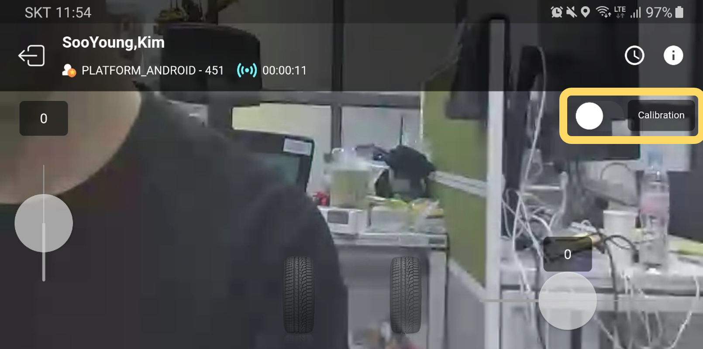

# RC카 영점 조절하기

> 우리가 사용중인 RC카는 로봇용이 아니기에 제품마다 특성이 다릅니다.
> 
> 
> 이를 보정하기 위해 조향값과 전후진값의 영점을 조절해야 합니다. 이에 대한 설정을 SpiderPlay 앱으로 손쉽게 작업해봅시다.
> 

## 📢 [Jetson Nano] Calibration 프로그램 실행

젯슨 나노에서 영점 조절 기능을 가진 프로그램을 실행합니다. 

이 파이썬 파일의 이름은 [calibration.py](http://calibration.py) 이며, 실행의 편의를 위해 별도로 쉘 스크립트를 작성하였으니, 다음 커멘드 라인을 통해 실행하시면 됩니다.

```bash
$ cd hello-mars-spidercar
$ ./calibration.sh
```

<aside>
💡 success가 되었는지 꼭 확인하세요!!

</aside>

## 📢 [모바일] SpiderPlay내 Calibration 기능 사용하기

**SpiderPlay**를 실행하고, `SooYoung,Kim` 채널로 접속합니다. (기본적으로 calibration 기능은 이 채널을 사용하도록 되어있습니다.)

실행한 이후, 아래 사진과 같이 Calibration 토글 스위치를 On 시키면 영점 조절 모드로 접근이 가능합니다.

<p align="center">
    
</p>

영점 조절 모드가 되었습니다.  

<aside>
💡 상단 사진과의 차이점이 보이시나요?? 0이었던 값들이 375와 같이 변한 것을 확인할 수 있습니다!

</aside>

<p align="center">
    
</p>

## 📢 찾아낸 영점값들을 저장하기

이 값은 모터 제어를 위한 raw value으로 이들을 통해 실험적으로 다음과 같은 값들을 찾아냅니다.   

- 똑바로 전진하기 위한 조향값
- 무게가 있는 차체를 앞뒤로 이동시키기 위한 최소값

위 값들은 잘 적어두었다가, 아래와 같은 포맷으로 정적 파일인 **`calib_param.json`** 에 기입하시면 됩니다. 

```bash
		"SpiderCar6": {
        "CAR_NAME": "SpiderCar6",
        "ChannelID": "c4i6suupjh6ddg9vdt50",
        "Calibration": {
            "THROTTLE_ZERO": 375,
            "FORWARD_ZERO": 399,
            "STEERING_ZERO": 399,
            "THROTTLE_MIN": 300,
            "THROTTLE_MAX": 440,
            "STEERING_MIN": 319,
            "STEERING_MAX": 479
        },
        "UI": {
            "THROTTLE_STEP": 20,
            "STEERING_STEP": 20
        }
    },
```

- 주요 값들과 이에 대한 설명을 덧붙이겠습니다!

`THROTTLE_ZERO` : 로봇이 전 후진 없이 가만히 있는 상태에서의 값

`FORWARD_ZERO` : 로봇이 전진을 시작하는 시점의 값

`STEERING_ZERO` : 로봇이 똑바로 앞을 바라볼 때의 조향값

`THROTTLE_MIN` : 후진 최대값

`THROTTLE_MAX` : 전진 최대값

`STEERING_MIN` / `STEERING_MAX` : 조향 최대/최소값

위 작업은 다소 귀찮을 수 있습니다. 

노하우를 남기자면, 저의 경우 **쭉 뻗은 복도에서 똑바로 주행하는 실험**을 통해 알아내고 있습니다.