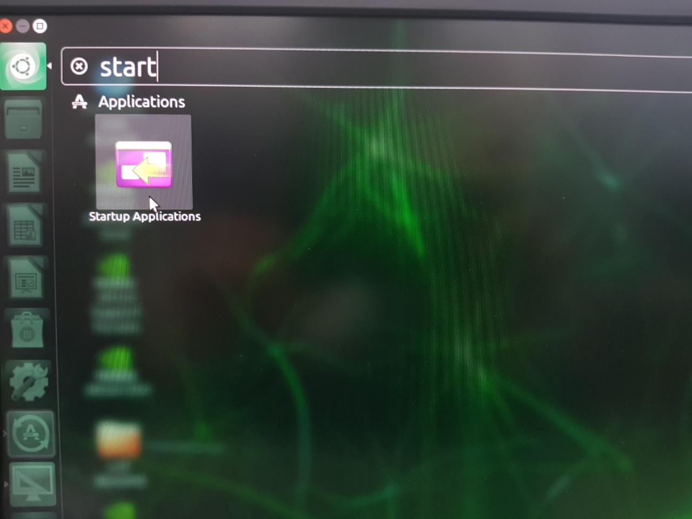

# 부팅 시 자동 실행기키기

> Jetson Nano가 부팅되는 시점에 SpiderCar를 자동 실행할 수 있도록 합니다.
> 

## 📢 **Startup Application 설정**

- **Jetson Nano**에서 `windows key` + `"start"` 를 입력하면  다음과 같이 **Startup Application**을 확인할 수 있습니다.


<p align="center">
    
</p>

이 메뉴를 선택하면 아래와 같은 화면을 확인할 수 있는데요.

여기서 **Add**를 선택하여 새로운 Startup Application을 실행합니다.


<p align="center">
    
</p>


<p align="center">
    
</p>

- Name : **SpiderCar**
- Command : `/bin/bash -c "sleep 15 && python3 /home/spidercar/Documents/hello-mars-spidercar/SpiderDonkey_Async.py"`
- Comment : 주석으로 없어도 됩니다.

```bash
/bin/bash -c "sleep 15 && python3 /home/spidercar/Documents/hello-mars-spidercar/SpiderDonkey_Async.py"
```

<aside>
💡 위 라인은 15초 후, **SpiderDonkey_Async.py** 파일을 실행하라는 뜻입니다.

</aside>

<aside>
💡 만약 사용중인 유저의 홈 디렉토리 이름이 `/home/test` 라면, 위 라인에서 spidercar ⇒ test로 이름을 변경해주셔야 합니다.

</aside>

만약 자동 실행을 중지하고 싶은 경우, **체크박스를 해제**하면 됩니다.

> 따라서, 개발 중에는 **체크박스를 해제**한 뒤, **개발 완료 후에는 다시 체크박스**를 쳐서 자동실행을 다시  실행시키면 되는 것이지요.
> 

## 😱 오류 상황

---

> 분명 일반 실행 시에는 잘 동작했는데, 자동 실행으로 해보니 작동이 안된다.
> 

⇒ 이런 경우, 여러 요인이 있으며 제가 확인한 바로는 **"실행되는 프로그램이 참조하는 정적파일의 권한 문제"**가 있었습니다.