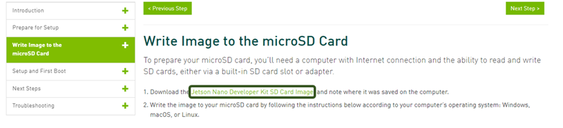

# 젯슨 나노 세팅하기

# 📗 Jetson Nano Setup

---

> SD Card에 Jetpack을 Flash하고 첫 부팅을 해봅시다.
> 

> **필요 물품**
> 
> - Jetson Nano Development Kit
> - SD Card (≥ 32GB)
> - SD Card Reader
> - DC 전원 공급 장치 (Barrel Jack)
> 
> **필요 소프트웨어**
> 
> - balenaEtcher - [https://www.balena.io/etcher/](https://www.balena.io/etcher/)
> - SD Card Formatter - [https://www.sdcard.org/downloads/formatter/sd-memory-card-formatter-for-windows-download/](https://www.sdcard.org/downloads/formatter/sd-memory-card-formatter-for-windows-download/)
> - (option) Putty - [https://www.putty.org/](https://www.putty.org/)

<aside>
💡 **Flash**를 진행하는 PC의 OS는 Windows를 사용하겠습니다.

</aside>

## 📢 SD Card Flash

- **NVIDIA 공식 개발자 홈페이지에서 Jetpack 4.6 OS 이미지를 다운받습니다.**
    
    <p align="center">
        
    </p>
    
    [Getting Started With Jetson Nano Developer Kit](https://developer.nvidia.com/embedded/learn/get-started-jetson-nano-devkit#write)
    
    링크를 클릭하면 자동으로 다운로드가 시작됩니다.
    
- **SD Card와 리더기를 준비한 후, PC에 인식시키고, 이전에 사용한 경험이 있는 SD Card의 경우 SD Card Formatter를 사용하여 포맷합니다.**
    
    <aside>
    💡 갓 개봉한 새제품이라면 굳이 포맷하지 않아도 좋습니다.
    
    </aside>

    <p align="center">
        
    </p>
    

- OS Image를 Flash 해보겠으며, 두가지 방법을 소개하겠습니다.
1. **balenaEtcher**를 통해 OS Image를 Flash
2. **NVIDIA sdkmanager**를 통해 Custom OS Image를 Flash (ubuntu 18.04 환경에서 진행하기를 추천)

## ⚡ [Recommended] **balenaEtcher를 통해 OS Image를 Flash**

- **balenaEtcher를 통해 OS Image를 Flash**
    
    다음과 같은 순서로 OS Image와 SD Card를 선택하여 Flash합니다.
    
    <aside>
    💡 마지막에 이르러 갑자기 수많은 창이 생길 수 있습니다. 오류가 아니니 걱정 마세요!
    
    </aside>

    <p align="center">
        
    </p>
    <p align="center">
        
    </p>
    <p align="center">
        
    </p>
    <p align="center">
        
    </p>

## ⚡ [Advanced] sdkmanager를 통해 Custom OS Image를 Flash

- **sdkmanager를 통해 Custom OS Image를 Flash (ubuntu 18.04 환경 추천)**
    
    > DeepStream을 사용하고 싶거나, VPI example등을 셋업하고 싶은 경우, 혹은 불필요한 예시들을 제외한 나만의 Custom Jetpack을 만들고 싶다면 **sdkmanager** 사용을 추천합니다.
    > 
    
    - 기본 사용법은 `jetsonhacks`님의 동영상을 추천드립니다.
    
    [https://www.youtube.com/watch?v=s1QDsa6SzuQ](https://www.youtube.com/watch?v=s1QDsa6SzuQ)
    
    사용 방법은 다음과 같습니다.
    
    <p align="center">
        
    </p>
    <p align="center">
        
    </p>
    
    <aside>
    💡 host machine에 NVIDIA 그래픽 카드가 없다면 체크를 해제해야 합니다.
    
    </aside>
    
    
    
    이 부분까지 왔다면, 이제 젯슨 셋업이 필요합니다!
    
    <p align="center">
        
    </p>
    
    후면 하단을 보면 각종 유틸 핀들이 위치해 있습니다. 
    
    이 중, FC REC와 GND를 쇼트시키면 Force Recovery Mode로 진입합니다.
    
    <p align="center">
        
    </p>
    
    이후, 다음과 같은 순서로 젯슨을 세팅합니다. 
    
    1. 베럴잭 연결
    2. micro 5 pin 케이블과 PC를 연결
    3. HDMI를 연결
    
    <p align="center">
        
    </p>
    
    <aside>
    💡 micro 5 pin 케이블과 PC를 연결한 이후 `lsusb`를 통해 Nvidia Corp가 인식되었는지 확인해야 합니다.
    
    </aside>
    
    <p align="center">
        
    </p>
    
    <aside>
    💡 HDMI를 연결해두면, Flash 이후 자동으로 초기 부팅 설정으로 진입할 것입니다. 모니터 없이 작업하고 싶다면 `Putty`나 `minicom` 사용을 추천드립니다.
    
    </aside>
    
    ```python
    sudo minicom -D /dev/ttyUSBX
    ```
    
    <p align="center">
        
    </p>
    

이후 과정은 사용자의 이름을 지정하고 비밀번호 설정, 국가와 언어 설정 등이 이어집니다.

해당 작업은 **Raffaello Bonghi**님의 영상을 참고하시길 추천드립니다.

[Jetson Nano First boot](https://youtu.be/eb-rt6qJIsM?t=272)

> 젯슨의 첫 부팅에 성공하셨나요? 😇
> 

다음과 같은 화면을 보셨다면 성공입니다!!

<p align="center">
        
    </p>

- image from - [https://imadelhanafi.com/posts/jetson_nano_setup/](https://imadelhanafi.com/posts/jetson_nano_setup/)

> Jetpack은 **Ubuntu 18.04를 기반으로 구성**되었습니다. 따라서 Linux를 다루는 커멘드에 대해서 배워보겠습니다.
> 

# 💻리눅스 커멘드 기초

---

리눅스는 마우스 클릭 기반의 GUI가 아닌 터미널 상에서의 커멘드 라인을 통해 주로 작업이 이루어집니다.

기존 Windows 사용자 분들께서도 아래 사진과 같은 명령 프롬프트를 한번쯤 접해보셨을 것 같은데요, 이런 검은 화면에 글자들이 빼곡한 상황이 리눅스에서는 주로 이루어집니다. 

<p align="center">
        
    </p>

- windows의 명령 프롬프트

<aside>
💻 하지만, 전혀 어렵지 않고 몇가지 커멘드만 알고 있다면 유용하게 사용할 수 있으니 문서를 잘 따라오시면 문제없이 사용하실 수 있으실 것입니다.

</aside>

**아래 작업들을 차근차근 따라와 주세요!**

- 터미널을 실행시키기 : `ctrl` + `alt` + `t`
- 새로운 폴더(디렉토리)로 옮겨가기 : `cd <특정 위치>`
    
    cd는 change directory라는 뜻으로, 마치 우리가 윈도우에서 여러 폴더를 오가는 작업과 동일합니다.
    
    <p align="center">
        
    </p>
    
    여기서의 특정 위치는 **상대 경로**와 **절대 경로**가 해당되는데요. 이들에 대해서 알아보겠습니다.
    
    - **상대 경로 : 우리집(402호) ⇒ 우리 옆집(401호)**
    - **절대 경로 : 우리집(서울시 성동구 oo동 xx 아파트 402호)**
    
    ⇒ 상황에 따라, 상대 경로가 편리한 경우가 있을 것이고, 진입하고자 하는 위치가 현 위치와 너무 멀리 떨어져 있는 경우 절대 경로가 보다 유리할 것입니다. 
    
    추가적으로 `./` 는 현재 위치를, `../` 는 현재 위치에서 한 단계 상위 위치를 뜻하며, 
    
    `cd ../../../` 와 같이 중첩하여 사용 가능합니다.
    
    - 자주 사용되는 구문을 보겠습니다.
    
    `cd ~/` 는 사용자의 홈 디렉토리로 안내합니다.
    
    저의 경우 `cd ~/Documents` 에서 주로 작업을 진행합니다.
    

- 현 디렉토리에서 진입 가능한 모든 파일, 프로그램, 폴더들을 보기 : `ls`
    
    이제, 여러 폴더(=디렉토리)들을 옮겨가며 탐험을 하고자 합니다.
    
    현재 위치에서 접근할 수 있는 폴더들은 무엇이 있는지, 실행 가능한 프로그램들은 어떠한 것들이 있는지 그 **리스트**를 확인하고 싶습니다.
    
    <p align="center">
        
    </p>
    
    이러한 경우 ls 를 사용하면 접근 가능한 모든 것들을 보여준답니다.
    
    ```python
    $ ls
    ```
    

- 현재 위치한 절대경로를 얻어내기 : `pwd`
    
    여기저기 디렉토리들을 탐험하다가, 현재 위치의 절대경로를 얻고자 할 때, `pwd`를 사용하면 편리하게 알아낼 수 있습니다.
    
    ```python
    $ pwd
    /home/kimsooyoung/Documents
    ```
    

- super user 권한으로 실행하기 : `sudo`
    
    사진과 같이, Windows에서도 특정 프로그램의 경우 관리자 권한으로 실행하거나, 수정해야 하는 상황이 있습니다.
    
    <p align="center">
        
    </p>
    
    리눅스에서도 비슷한 작업이 가능하며 이는 sudo를 통하여 실행 가능합니다!!
    
    ```python
    $ sudo <something>
    ```
    
    언제 이러한 권한이 필요하냐구요? 바로 다음 이어집니다!!
    
- 리눅스 패키지 관리자 : `apt`
    
    우선, apt를 한번 사용해보겠습니다
    
    ```python
    $ sudo apt install terminator
    ...
    
    # 작업이 완료된 이후, 다음 단어를 입력하고 엔터를 눌러주세요.
    $ terminator
    ```
    
    <p align="center">
        
    </p>
    
    새로운 디자인의 터미널이 켜졌습니다. 방금 우리는 **terminator**라는 별도의 프로그램을 설치한 것인데요, 보통 홈페이지에서 설치 프로그램을 다운받아 여러번의 클릭이 필요한데, 리눅스의 `apt`는 이러한 과정을 라인 하나로 손쉽게 가능하도록 해줍니다!
    
- 디렉토리 생성하기 : `mkdir` & 파일 생성하기 : `touch` & 삭제하기 : `rm`
    
    지금까지 배운 커멘드를 복습해 보면서, 위 커멘드들도 소개해 보겠습니다!
    
    ```python
    # 디렉토리의 생성
    $ mkdir test_floder
    # 생성 확인
    $ ls
    
    # 디렉토리 진입
    $ cd test_floder
    # 파일 생성
    $ touch test_file.txt
    # 생성 확인
    $ ls
    
    # 상위 디렉토리로 옮겨가기
    $ cd ../
    # 디렉토리와 그 안의 것들을 모두 삭제하기
    $ rm -r test_folder
    ```
    
- 리눅스의 장치 관리자 : `/dev`
    
    Jetson Nano의 USB에 특정 센서(저는 rplidar를 사용하였습니다.)를 꽂은 다음, 아래 커멘드를 입력해 보세요
    
    ```python
    $ cd /dev
    $ ls
    
    $ ls | grep ttyUSB
    
    ```
    
    위와 같이 시리얼 통신이 가능한 기기는 리눅스 드라이버를 통해 ttyUSB 혹은 ttyACM 이라는 이름으로 인식됩니다.
    
     `| grep` 키워드는 커멘드 결과 중 보고 싶은 부분만을 잡아(=grep) 보여주는 고마운 친구랍니다.
    
- 다시 시작 : `reboot`

<aside>
🧑‍🏫 이밖에도 수많은 리눅스 커멘드들이 존재하며, 사실 저 또한 모든 것을 알지는 못합니다. 하지만 원하는 기능이 혹시 이미 존재하는지 검색해보시고, 있다면 익숙하게 사용하면서 자연스레 외우시기를 추천드립니다.

</aside>
