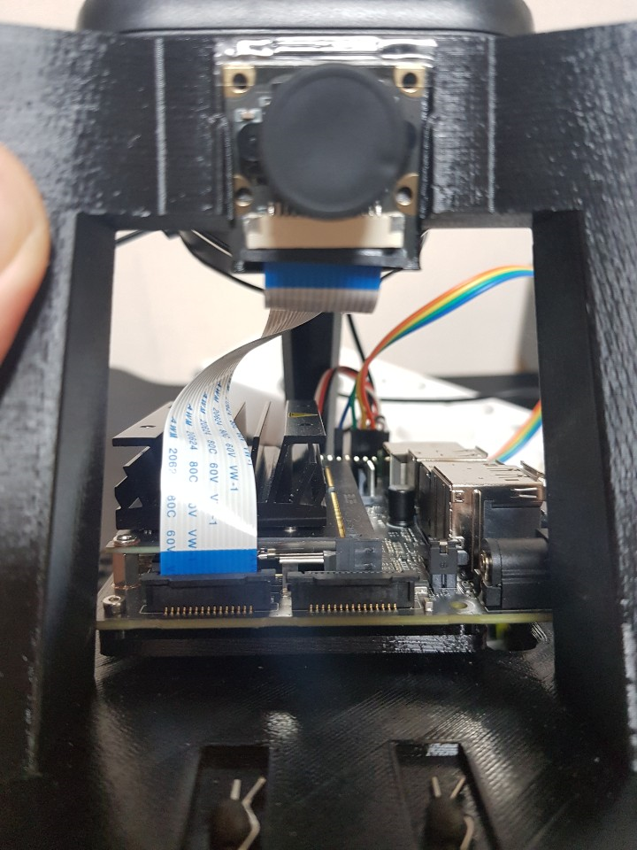

# 코드 설명 - CSI Camera

SpiderCar에 부착되는 카메라는 일반 웹캠이 아닌, Direct memory access (DMA)가 가능한 작접 연결 카메라 입니다. MIPI CSI 버스를 사용하기 때문에 CSI 카메라라고 불리고 있습니다.

> **이 CSI 카메라의 연결법과 사용법, 그리고 실제 SpiderCar에서는 어떻게 사용되고 있는지를 설명하겠습니다.**
> 

사용하는 카메라 정보는 다음과 같습니다. 

- CSI Camera - devicemart link

[IMX219 젯슨나노 160도 광각 카메라 모듈 8MP](https://www.devicemart.co.kr/goods/view?no=12538383)

- CSI Camera - aliexpress link

[13.0US $ 45% OFF|NVIDIA Jetson Nano 용 8MP IMX219 카메라, 15 cm 플렉시블 플랫 케이블이 있는 Jetson Nano 용 77 도 1080P CSI 카메라 모듈|Demo Board Accessories| - AliExpress](https://ko.aliexpress.com/item/4000112261464.html)

## 📢 카메라 연결

---

사용하는 젯슨 모델에 따라 다르지만 4GB 모델의 경우 두개의 카메라 DMA 포트가 있습니다.

각각 0번, 1번에 해당하며 사진과 같이 구성되어 있습니다.

<p align="center">
    
</p>


**왼쪽이 0번 오른쪽이 1번**으로 잡혀 있으며 (다음 연결 확인 단계에서 이 번호를 잘 확인해 주세요), 부팅 후 연결하면 인식이 되질 않으니, 미리 연결하신 뒤 부팅하시길 추천드립니다.

## 📢 연결 확인

---

Jetson 상에서 다음 커멘드 라인을 통해 제대로 연결되어있는지 여부를 확인합니다.

```bash
$ gst-launch-1.0 nvarguscamerasrc sensor_id=0 ! \
   'video/x-raw(memory:NVMM),width=3280, height=2464, framerate=21/1, format=NV12' ! \
   nvvidconv flip-method=0 ! 'video/x-raw,width=960, height=720' ! \
   nvvidconv ! nvegltransform ! nveglglessink -e
```

위 커맨드 라인을 살펴보면, 설정하는 여러 옵션들을 확인할 수 있습니다.

- `sensor_id=0` : 앞서 연결한 포트 번호입니다.
- `width` / `height` / `framerate` :  capture 당시 영상의 설정과, 이후 작업에 쓰일 영상의 여러 옵션들을 설정합니다.
- `flip-method=0` : 카메라를 돌려서 사용하는 경우, 이 값을 바꿔주셔야 합니다.
    - 0 : 그대로 사용
    - 1 : 90도 회전
    - 2: 180도 회전
    - 3: 270도 회전

<aside>
💡 회전은 반시계 방향이며, 라즈베리 카메라와 저희가 사용한 카메라는 180도 차이가 있습니다.

</aside>

## 📢 OpenCV gstreamer 연동 확인

---

CSI Camera를 사용하기 위해선 gstreamer가 연동된 OpenCV가 필요합니다.

하지만, OpenCV빌드 시 gstreamer이 포함되지 않은 경우가 있습니다. 이는 다음과 같이 확인합니다.

```python
$ python3
>>> import cv2
>>> print(cv2.getBuildInformation())
---------------------------------------------------------------------
# 수많은 옵션들이 나오며, 그 중에서 다음을 확인해줍니다.
Video I/O:
    DC1394:                      YES (2.2.5)
    FFMPEG:                      YES
      avcodec:                   YES (58.54.100)
      avformat:                  YES (58.29.100)
      avutil:                    YES (56.31.100)
      swscale:                   YES (5.5.100)
      avresample:                YES (3.7.0)
    **GStreamer:                   YES (1.14.5)**
    v4l/v4l2:                    YES (linux/videodev2.h)
```

**GStreamer**가 No로 되어 있다면, 아래와 같이 커스텀 OpenCV 4.1 빌드 스크립트를 실행합니다. 

<aside>
💡 시간이 상당히 오래**(2시간 이상)** 걸리는 작업이니 고려하셔서 스케줄링 하시길 바랍니다.

</aside>

```python
cd ~/Downloads
git clone https://github.com/Road-Balance/buildOpenCV.git
cd buildOpenCV
sudo ./buildOpenCV.sh
```

## 📢 RTCBot 연동

---

rtcbot의 CVCamera 클래스는 다음 링크와 같이 구성되어있습니다.

[rtcbot.camera - RTCBot 0.1.0 documentation](https://rtcbot.readthedocs.io/en/latest/_modules/rtcbot/camera.html)

생성자 부분에서는 캡쳐할 카메라 정보들과 부모 클래스의 생성자를 호출하고 있습니다.

카메라를 다루는 경우 일반적으로 사용되는 설정들이기에 크게 다루지는 않겠습니다.

```python
def __init__(
        self,
        width=320,
        height=240,
        cameranumber=0,
        fps=30,
        preprocessframe=lambda x: x,
        loop=None,
    ):

        self._width = width
        self._height = height
        self._cameranumber = cameranumber
        self._fps = fps
        self._processframe = preprocessframe

        super().__init__(MostRecentSubscription, self._log, loop=loop)
```

다음으로, `_producer`  함수를 살피겠습니다. 이 함수에서는 다음과 같은 작업들이 이루어집니다.

- OpenCV의 카메라 핸들러인 VideoCapture 객체를 생성하고 이미지를 받아옵니다.
- 받아온 이미지는 `_put_nowait`를 통해 rtc publisher에게 전달됩니다.

```python
def _producer(self):
	...
	ret, frame = cap.read()
	...
	frame = self._processframe(frame)
	...
	self._put_nowait(frame)
	...
```

위와 같은 **CVCamera** 클래스를 참조하여, CSI 카메라를 다룰 수 있는 커스텀 클래스 개발이 가능하며, 제가 개발한 코드는 다음과 같습니다.

- CSICamera 코드 ([rtc_cam.py](https://github.com/teamgrit-lab/hello-mars-spidercar/blob/master/RTCCam/rtc_cam.py) 중)
    
    ```python
    class CSICam(CVCamera):
        """
        GSTCam For Jetson Nano
        """
    
        _log = logging.getLogger("rtcbot.CSICam")
    
        def __init__(
            self,
            width=640,
            height=480,
            camID=0,
            fps=60,
            flip_method=2,
            preprocessframe=lambda x: x,
            loop=None,
            capture_mode="CV",
        ):
    
            self._width = width
            self._height = height
            self._cameranumber = camID
            self._fps = fps
            self._flip_method = flip_method
    
            self._processframe = preprocessframe
            self._capture_mode = capture_mode
    
            self._is_camera_on = False
    
            super().__init__(
                self._width, self._height, self._cameranumber, self._fps, self._processframe
            )
    
        def gstreamer_pipeline(
            self,
            capture_width=1280,
            capture_height=720,
            framerate=60,
            flip_method=2,
        ):
            return (
                "nvarguscamerasrc sensor_id=%d ! "
                "video/x-raw(memory:NVMM), "
                "width=(int)%d, height=(int)%d, "
                "format=(string)NV12, framerate=(fraction)%d/1 ! "
                "nvvidconv flip-method=%d ! "
                "video/x-raw, width=(int)%d, height=(int)%d, format=(string)BGRx ! "
                "videoconvert ! "
                "video/x-raw, format=(string)BGR ! "
                "appsink"
                % (
                    self._cameranumber,
                    capture_width,
                    capture_height,
                    self._fps,
                    flip_method,
                    self._width,
                    self._height,
                )
            )
    
        def gst_to_opencv(self, sample):
            buf = sample.get_buffer()
            caps = sample.get_caps()
    
            # print(caps.get_structure(0).get_value("format"))
            # print(caps.get_structure(0).get_value("height"))
            # print(caps.get_structure(0).get_value("width"))
    
            # print(buf.get_size())
    
            arr = np.ndarray(
                (
                    caps.get_structure(0).get_value("height"),
                    caps.get_structure(0).get_value("width"),
                    3,
                ),
                buffer=buf.extract_dup(0, buf.get_size()),
                dtype=np.uint8,
            )
            return arr
    
        def _producer(self):
            """
            Runs the actual frame capturing code.
            """
    
            gst_cmd = self.gstreamer_pipeline(
                capture_width=1280, capture_height=720, flip_method=self._flip_method
            )
            print(gst_cmd)
    
            if self._capture_mode == "GST":
                pipeline = Gst.parse_launch(gst_cmd)
                sink = pipeline.get_by_name("sink")
                pipeline.set_state(Gst.State.PLAYING)
            elif self._capture_mode == "CV":
                print("CV Mode")
                cap = cv2.VideoCapture(gst_cmd, cv2.CAP_GSTREAMER)
                cap.set(cv2.CAP_PROP_FRAME_WIDTH, self._width)
                cap.set(cv2.CAP_PROP_FRAME_HEIGHT, self._height)
                cap.set(cv2.CAP_PROP_FPS, self._fps)
    
                if self._is_camera_on == False:
                    ret, frame = cap.read()
                    if not ret:
                        self._log.error("Camera Read Failed %s", str(ret))
                        cap.release()
                        self._setError(ret)
                        return
                    else:
                        self._is_camera_on = True
                        self._log.debug("Camera Ready")
    
            self._setReady(True)
            while not self._shouldClose:
                if self._capture_mode == "GST":
                    sample = sink.emit("pull-sample")
                    if not sample:
                        continue
                        self._log.error("GST read error")
                    else:
                        new_frame = self.gst_to_opencv(sample)
                        self._put_nowait(new_frame)
    
                elif self._capture_mode == "CV":
                    ret, frame = cap.read()
                    if not ret:
                        self._log.error("CV read error %s", str(ret))
                    else:
                        self._put_nowait(frame)
    
            if self._capture_mode == "CV":
                cap.release()
    
            pipeline.set_state(Gst.State.NULL)
            self._setReady(False)
            self._log.info("Ended camera capture")
    ```
    

> CSI Camera는 일반 OpenCV VideoCapture 함수를 통해 곧바로 이미지를 얻어올 수 없다는 문제가 있습니다.
> 

**"연결 확인"**에서 사용한 바와 같이 gstreamer 파이프라인을 통해 이미지를 convert 한 다음, appsink로 반환해야 비로소 OpenCV와 파이썬에서 사용할 수 있으며, 이에 대한 파이프라인 구성은 다음 코드로 표현됩니다.

```python
def gstreamer_pipeline(
        self,
        capture_width=1280,
        capture_height=720,
        framerate=60,
        flip_method=2,
    ):
        return (
            "nvarguscamerasrc sensor_id=%d ! "
            "video/x-raw(memory:NVMM), "
            "width=(int)%d, height=(int)%d, "
            "format=(string)NV12, framerate=(fraction)%d/1 ! "
            "nvvidconv flip-method=%d ! "
            "video/x-raw, width=(int)%d, height=(int)%d, format=(string)BGRx ! "
            "videoconvert ! "
            "video/x-raw, format=(string)BGR ! "
            "appsink"
            % (
                self._cameranumber,
                capture_width,
                capture_height,
                self._fps,
                flip_method,
                self._width,
                self._height,
            )
        )
```

<aside>
💡 파이프라인의 각 요소들에 대한 설명은 일전 연결 확인과 같으므로 생략합니다.

</aside>

이렇게 구성된 파이프라인을 통해 이제 OpenCV에 연동하고 이미지를 받아옵니다.

VideoCapture의 매개변수로 파이프라인 텍스트를 전달하면 이러한 과정이 가능하지요.

```python
				gst_cmd = self.gstreamer_pipeline(
            capture_width=1280, capture_height=720, flip_method=self._flip_method
        )

				...

				print("CV Mode")
        cap = cv2.VideoCapture(**gst_cmd**, cv2.CAP_GSTREAMER)
        cap.set(cv2.CAP_PROP_FRAME_WIDTH, self._width)
        cap.set(cv2.CAP_PROP_FRAME_HEIGHT, self._height)
        cap.set(cv2.CAP_PROP_FPS, self._fps)
```

연동된 이후로는 일반 OpenCV에서의 웹캠 다루기와 동일한 작업이 진행됩니다.

```python
        if self._is_camera_on == False:
            ret, frame = cap.read()
            if not ret:
                self._log.error("Camera Read Failed %s", str(ret))
                cap.release()
                self._setError(ret)
                return
            else:
                self._is_camera_on = True
                self._log.debug("Camera Ready")
```

rtcbot에는 송신될 이미지를 미리 확인할 수 있는 예시를 제공하고 있습니다.

이를 사용하여 작성한 예시는 main문과 같습니다.

```python
if __name__ == "__main__":
    camera = CSICam(camID=0)
    display = CVDisplay()

    frameSubscription = camera.subscribe()
    display.putSubscription(frameSubscription)

    try:
        asyncio.get_event_loop().run_forever()
    finally:
        camera.close()
        display.close()
```

- 참고로 rtcbot은 모두 asyncio를 기반으로 짜여 있으며,
- 따라서 CVDisplay내부에는 이벤트 루프가 구현되어 있고,
- `display.putSubscription` 을 통해 카메라의 핸들러를 넘겨주게 되면, 지속적으로 카메라 데이터를 받아오는 로직이 이벤트 루프에 등록됩니다.

run_forever를 통해 등록된 모든 이벤트 루프를 실행시키면, **CSICam**과, **CVDisplay**가 비동기로 상호작용하면서 등록된 이벤트를 실행하게 됩니다.

<aside>
💡 asyncio에 대한 기본과 예시는 다음 튜토리얼을 참고바랍니다.

</aside>

[RTCBot Basics - RTCBot 0.2.4 documentation](https://rtcbot.readthedocs.io/en/latest/examples/basics/README.html)

 

## 📢 Dual CSI Cam

> 본디, SpiderCar는 전후방으로 각각 카메라가 달려 총 2개의 카메라를 장착하게 되어 있습니다.
> 
> 
> 더불어, 이는 **후진 시 자동으로 전환**되는 기능을 갖추고 있습니다.
> 

지금부턴, 이와 같은 구현을 어떻게 할 수 있는지 설명해 보겠습니다.

<aside>
💡 참고로, 위 기능이 2개의 카메라를 사용할 수는 있게 개발되어 있지만, 이는 다중 채널로 여러 이미지 스트림을 송출하는 것은 아닙니다.

</aside>

단순히 카메라 1의 이미지를 보내고 있는 순간에, 그 이미지를 카메라 2의 것으로 교체하는 식으로 개발하였으며, 이를 **Dual CSI Cam**이라고 이름 붙였습니다.

**코드는 다음 링크에 존재합니다.**

[dual_cam.py](https://github.com/teamgrit-lab/hello-mars-spidercar/blob/master/RTCCam/dual_cam.py)

필요한 부분만을 살펴보겠습니다.

- **producer**

같은 설정을 가진 두개의 카메라 객체를 생성합니다. 

각각 전방과 후방 카메라에 해당합니다.

```python
def _producer(self):
    self._cam1 = WebCam(self._cam_num1, self._dispW, self._dispH)
    self._cam2 = WebCam(self._cam_num2, self._dispW, self._dispH)
```

클래스 변수인 `self._mode`의 값이 변함에 따라, 앞뒤 카메라의 전환이 이루어지게 되며, 이의 코드 구현은 다음과 같습니다.

```python
    while not self._shouldClose:
        if self._mode:
            frame = self._cam1.getFrame()
        else:
            frame = self._cam2.getFrame()

        self._put_nowait(frame)

    self._cam1.stop()
    self._cam2.stop()
    self._setReady(False)
```

만약 외부에서 `self._mode`의 값을 토글한다면, 카메라 뷰의 전환이 이루어지는 것이지요.

Daul Cam을 테스트하기 위한 코드는 다음과 같습니다.

일전과 마찬가지로 asyncio와의 호환을 위해 이벤트 루프를 작성 후 등록하고, 이는 `run_forever` 발동 시 실행을 시작합니다.

```python
if __name__ == "__main__":

    # camera = DualCam(cam_num1=0, cam_num2=4, width=640, height=480)
    camera = DualCSICam(cam_num1=0, cam_num2=1, width=640, height=480, flip1=2, flip2=0)
    display = CVDisplay()

    frameSubscription = camera.subscribe()
    display.putSubscription(frameSubscription)
    loop = asyncio.get_event_loop()

    def get_input():
        mode = True if input(f"Mode you want : ") == "2" else False
        camera.set_mode(mode)

    async def input_loop():
        while True:
            await loop.run_in_executor(None, get_input)

    try:
        asyncio.ensure_future(input_loop())
        loop.run_forever()
    finally:
        camera.close()
        display.close()
```

프로그램을 시작하신 뒤, 키보드 입력을 통해 앞뒤 카메라간의 전환이 가능합니다!!