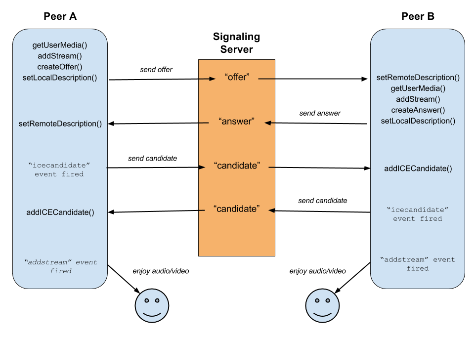

# 코드 설명 - RTCPub

> Spider RTC와 peer connection을 하기 위한 RTCPub입니다.
> 

<aside>
💡  본 코드를 이해하기 위해서는 아래와 같이 WebRTC PeerConnection 절차에 대한 이해가 필요합니다. 관련해선 [박현상님의 블로그](https://medium.com/@hyun.sang/webrtc-webrtc%EB%9E%80-43df68cbe511)를 참고하시면 좋습니다.

</aside>

<p align="center">
    
</p>

 코드를 바로 살피기 이전에, 어떠한 과정들이 진행되는지 살펴보겠습니다.

1. `RTCConnection`을 통해 **Peer Connection** 객체 생성
2. `getLocalDescription`을 통해 `localDescription`을 받아오기
3. `localDescription`을 사용하여 Spider Pub 서버로 **offer** 전송
4. **answer**을 받아 해당 내용을 바탕으로 `remoteDescription`등록

그럼 위의 과정들을 하나씩 코드상에서 살펴보겠습니다.

[rtc_pub.py](https://github.com/teamgrit-lab/hello-mars-spidercar/blob/master/RTCPub/rtc_pub.py)

위 파일을 살펴보면, 결국 모든 클래스들은 가장 최상위 부모 클래스인  RTCPublisher로부터 파생되고 있는 모습을 확인할 수 있습니다.

따라서 RTCPublisher를 위주로 코드 설명을 진행하고, 파생 클래스들은 차이점들만 살펴보도록 하겠습니다.

## 📢 `RTCConnection`을 통해 **Peer Connection** 객체 생성

- **RTCPublisher** 클래스의 생성자를 살피겠습니다.

```python
class RTCPublisher(object):
    def __init__(self, channel="c0dko1upjh69daabh9pg"):
        self._servers = [
            # order
            # 1. stun
            # 2. turn - udp
            # 3, turn - tcp
            RTCIceServer(urls="stun:{SERVER_DOMAIN}:3478"),
            RTCIceServer(
                urls=f"turn:{SERVER_DOMAIN}:3478?transport=udp",
                username="teamgrit",
                credential="teamgrit8266",
            ),
            RTCIceServer(
                urls=f"turn:{SERVER_DOMAIN}:3478?transport=tcp",
                username="teamgrit",
                credential="teamgrit8266",
            ),
        ]  # 사용할 ice서버 정보

        self._peer = RTCConnection(
            rtcConfiguration=RTCConfiguration(iceServers=self._servers)
        )

        # 일반적인 SSLContext 객체를 생성합니다.
        self._sslcontext = ssl.create_default_context()
        self._sslcontext.check_hostname = False  # 호스트 이름확인을 활성화하지 않는다. (이름검사x)
        self._sslcontext.verify_mode = ssl.CERT_NONE  # 모든인증서 허용

        self._loop = asyncio.get_event_loop()
        self._channel = channel
```

Spider TURN, STUN Server를 configure한 뒤, 파이썬 패키지인 rtcbot의 제공 함수인  RTCConnection을 통해 peer를 생성하고 있습니다. 

하단 인증 설정은 주석이 되어 있으니 한번씩 읽어보시면 모두 이해가 가실 것입니다.

다음으로 핵심이 되는 **run** 함수를 보면 **connect** 함수를 이벤트 등록하고 있는 것을 확인 가능합니다.

```python
def run(self):
    try:
        asyncio.ensure_future(self.connect())
        self._loop.run_forever()
    except Exception as e:
        print(e)
    finally:
        print("Done...")
```

이렇게 구현된 이유는 현 프로그램의 종속성인 aiortc가 asyncio를 통한 비동기 방식을 사용하고 있기 때문이며, asyncio에 대한 간단한 튜토리얼은 하단 링크를 참고하여 습득하시면 됩니다. 

[RTCBot Basics - RTCBot 0.2.4 documentation](https://rtcbot.readthedocs.io/en/latest/examples/basics/README.html)

## 📢 `getLocalDescription`을 통해 `localDescription`을 받아오기 & `localDescription`을 사용하여 Spider Pub 서버로 **offer** 전송

- 시작점인 `connect` 함수를 살피겠습니다.

```python
async def connect(self):
    # 로컬 SDP를 얻는다.
    localDescription = await self._peer.getLocalDescription()
    pure_sdp = localDescription["sdp"]  # sdp의 주 내용들을 추출한다.
    result2_sdp = self.sdpUpdate(pure_sdp)
    print("-----offer begin")
    print(result2_sdp)
    print("-----offer end")
    # websocket통신 초기화
    async with aiohttp.ClientSession() as session:
        # 미리 정해진 채널에서 websocket을 초기화한다.
        async with session.ws_connect(  # channel id should be replaced / TODO : bitrate check
            url=f"wss://{SERVER_DOMAIN}:8267/live/ws/pub?channel={self._channel}&brate=800&ktime=100",
            ssl_context=self._sslcontext,
        ) as ws:
            # offer단계에서 전송할 sdp정보를 가진 json메시지를 만든다.
            json_offer = {"type": "offer", "data": result2_sdp}
            await ws.send_json(json_offer)  # json메시지를 전송한다.
            await self.validateWS(ws)
```

순서대로 동작하는 과정을 정리하면 다음과 같습니다.

1. `getLocalDescription`를 통해 **local SDP**인 `localDescription`를 받아옵니다. 
2. `localDescription`에서 필요한 부분만을 발췌하여 **offer 메세지**를 만듭니다. ⇒ `sdpUpdate` 함수를 사용 하나의 candidate를 선택합니다.
3. 만들어진 **offer 메세지**는 웹소켓 연결을 통해 spider의 **pub 서버**로 연결됩니다.
4. 연결 이후 준비해둔 offer 메세지를 전송합니다.

⇒ 이후 작업은 `validateWS`에서 이루어집니다.

## 📢 **answer**을 받아 해당 내용을 바탕으로 `remoteDescription`등록

이 과정은 모두 `**validateWS**` 함수 안에서 이루어지며, 다시 하나씩 살펴보겠습니다. 

Spider 서버에 보낸 offer의 응답에 해당하는 answer를 받아오고, 유효한 메세지인지를 검증합니다.

```python
async for msg in ws:  # websocket으로 받은 메시지 msg
    if msg.type == aiohttp.WSMsgType.TEXT:  # 정상적인 메시지일때
        msg_type = msg.json()["type"]  # 메시지의 타입을 저장한다.
        print("type is " + msg_type)
```

 

request가 정상적인 메세지라고 해서 모두 사용 가능한 것이 아니라 answer 메세지일 때만 우리가 필요로 하는 데이터를 갖고 있습니다. 따라서 아래와 같은 처리가 필요하지요.

```python
if msg.json()["type"] == "answer":  # offer에 대한 대답 메시지일 때,
		...
    print("success")
if msg.json()["type"] == "joins":  # 통신이 끊어지거나 새로 연결된경우
    pass
if msg.data == "close":  # 웹소켓 종료 메시지일 대
    await ws.close()  # 종료후 break한다.
    break
```

<aside>
💡 주로 사용되는 msg type은 **answer**, **join**, **ping**이 있으며, ping은 연결 이후 30초마다 정상 연결을 확인하는 메세지입니다.

</aside>

answer 메세지를 받았다면, 메세지 안의 유의미한 데이터를 사용하여 remoteDescription을 등록하고 **"success"**를 출력합니다. 

```python
if msg.json()["type"] == "answer":  # offer에 대한 대답 메시지일 때,
    message = msg.json()["data"]
    print(msg.json())
    json_answer = {
        "type": "answer",
        "sdp": message,
    }  # 받은 메시지를 기반으로 remotedescription을 만든다.
    # remoteDescription을 등록한다.
    await self._peer.setRemoteDescription(json_answer)
    print("success")
```

> 여기까지가 파이썬 사용해서 peer connection을 구성하는 과정입니다.
> 
> 
> 연결이 이루어진 이후, **실질적인 영상 송수신과 데이터 송수신**이 이루어져야 할 것이며, 지금부터는 이 부분을 살피도록 하겠습니다.
> 

## 📢  video stream 등록

rtcbot에서 제공하는 예시를 사용하여 video stream을 등록하는 방법은 다음과 같습니다. 

`RTCCSICamPublisher` 클래스의 생성자를 살펴보면 사용법을 확인할 수 있지요. 

```python
class RTCCSICamPublisher(RTCDataChannel):
		...
		self._cam = CSICam(cameranumber=cameranumber)
		self._peer.video.putSubscription(self._cam)  # 카메라 설정
		...
```

RTCCam 클래스인 CSICam을 생성한 뒤, `peer.video.putSubscription`에 넘겨주면 등록이 완료됩니다. 실질적인 동작은 CSICam에서 핸들링되기 때문에, 이에 대한 설명은 CSICam에 관한 문서를 참고 바랍니다.

<aside>
💡 여러  video stream 등록은 현재 지원하고 있지 않습니다.

</aside>

## 📢  data channel  등록

rtcbot에서 제공하는 예시를 사용하여 data channel 을 등록하는 방법은 다음과 같습니다. 

`RTCDataChannel` 클래스의 생성자를 살펴보면 사용법을 확인할 수 있지요. 

```python
class RTCCSICamPublisher(RTCDataChannel):
		...
		# peer객체에 "stream"이라는 이름의 데이터 체널을 추가한다.
    self._dc_metric = self._peer.addDataChannel("metric")
    self._dc_stream = self._peer.addDataChannel("stream")
    self._dc_metric_subscriber = self._dc_metric.subscribe()
    self._dc_subscriber = self._dc_stream.subscribe()
		...
```

- `addDataChannel` 함수를 통해 data channel stream을 생성 가능합니다. 이때, 함수 안에 들어가는 매개변수는 채널의 이름이 됩니다.
- 각 채널의 핸들러인 **subscriber**를 생성하기 위해선 `subscribe` 함수를 사용합니다.

실제 dataChannel을 사용하여 pub/sub을 하는 코드는 다음과 같습니다.

핸들러들이 기본적으로 파이썬의 **Queue** 자료구조를 사용하고 있어 `put_nowait` / `get` 함수를 통해 정보를 주고 받을 수 있습니다.

```python
		async def sender(self):
        while True:
            await asyncio.sleep(1)
            self._dc_metric.put_nowait("hi metric")

    async def receiver(self):
        while True:
            data = await self._dc_subscriber.get()
            print(data)
```

예제 실행은 다음과 같이 가능합니다. 

아래 사용 가능한 클래스 중 하나를 택하여 인스턴스를 생성하고, 매개변수로는 사용할 Spider 채널명을 입력합니다.

- **RTCWebCamPublisher**
- **RTCPublisher**
- **RTCSubscriber**
- **RTCDataChannel**

```python
if __name__ == "__main__":
    # [channel] ID: c40hipepjh65aeq6ndj0, Name: SooYoung, Kim

    # myRTCBot = RTCWebCamPublisher(channel="c0dko1upjh69daabh9pg")
    # myRTCBot = RTCPublisher(channel="c40hipepjh65aeq6ndj0")
    # myRTCBot = RTCSubscriber(channel="c4i6suupjh6ddg9vdt50")
    myRTCBot = RTCDataChannel(channel="c40hipepjh65aeq6ndj0")

    myRTCBot.run()
```

> 생성한 인스턴스의 **run** 함수를 실행하면 앞서 설명한 모든 일련의 동작들이 실행됩니다.
>