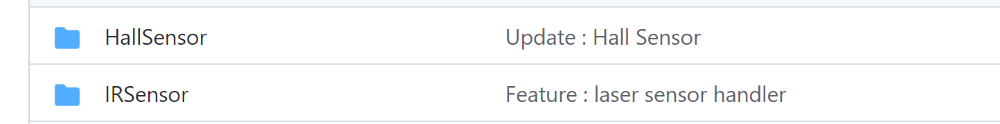

# 코드 설명 - 센서

> SpiderCar에는 적외선, 자석 센서를 비롯한 각종 센서들의 부착이 가능합니다. 이 센서들을 어떻게 다루고, 인식 후 dataChannel을 통해 송신하는 방법에 대하여 설명합니다.
> 

### 코드는 다음에 위치하고 있습니다.


<p align="center">
    
</p>


- `HallSensor` : 자석 센서를 다루는 패키지입니다.
- `IRSensor` : 적외선 센서를 다루는 패키지입니다.

실제 대회에서 사용되었던 것은 자석 센서이기에 이를 위주로 설명하겠으며, 마지막에 적외선과의 차이에 대해서도 이야기해보겠습니다.

## 📢 하드웨어 연결

위 예제를 실행하기 전에, 모든 센서가 Jetson의 GPIO에 제대로 연결되어있는지 확인이 필요합니다.

아래는 Jetson의 핀맵과, 각 핀이 프로그래밍 시 몇번 GPIO로 인식되는지를 보이는 사진 자료입니다.

<p align="center">
    
</p>

<p align="center">
    
</p>

여기에서, 우리가 살펴볼 것은 **`Pi GPIO#`**이며 여기서의 번호가 실제 프로그래밍시 사용되는 번호이지요.

예를 들어 제가 파이썬에서 **4번 GPIO**를 사용하겠다고 설정한다면, 실제로 이것은 **젯슨의 7번 핀**을 사용하게 되는 것입니다. 

<aside>
💡 전원선은 그대로 사용하면 됩니다.

</aside>

센서모듈을 사용할 시, 보통 다음과 같이 점퍼선을 연결할 수 있도록 실딩이 되어있습니다. 

판매 사이트 및 구글링을 통해 핀맵을 검색하신 뒤, 적절한 전원 공급과 핀 매칭을 해주시면 됩니다.

<p align="center">
    
</p>

우리가 사용하는 자석 센서는 **아두이노 리드 스위치**라는 모듈로, 핀맵 및 사용법은 판매 사이트에서  같이 친절하게 안내하고 있습니다.

보통 설명이 좋은 모듈은 구매율이 높기 때문에  이렇게 정리가 잘 되어 있는 경우가 많습니다. 

<p align="center">
    
</p>

⇒ 여기서 D3라는 뜻은 digital out 이라는 뜻이며, 센서의 동작 여부가 0 혹은 1로 이진 데이터가 들어온다는 뜻으로, 자석이 있다, 없다로 해석될 수 있을 것입니다.

모든 연결 과정을 잘 마쳤다면, 비로소 코드를 살펴보도록 하겠습니다.

## 📢 **hall_sensor.py 설명**

자석 센서를 다룰 수 있는 코드는 다음에 위치하고 있습니다.

[hall_sensor.py](https://github.com/teamgrit-lab/hello-mars-spidercar/blob/master/HallSensor/hall_sensor.py)

앞서 말하였던 GPIO를 사용하기 위해, 파이썬에서는 `Jetson.GPIO` 라는 패키지를 사용합니다. 

더불어, 비동기 처리를 위한 **asyncio**, 센싱된 시간을 추적하기 위해 time 패키지를 가져오고 있습니다.

```python
import Jetson.GPIO as GPIO
import asyncio
import time

DEBUG_MODE = True
```

`Jetson.GPIO` 를 통해 센서를 사용하기 위해서는 올바른 핀 연결과 더불어, 초기 세팅을 잘 해주어야 합니다.

아래 코드와 같이 사용할 핀의 번호를 지정하고, 이 핀의 사용을 위한 초기 셋업을 해줍니다.

```python
def __init__(self, sensor_pin_num):
    super().__init__()
    
    self.SENSOR_PIN = sensor_pin_num

    self._loop = asyncio.get_event_loop()
    self.GPIOSetup()

def GPIOSetup(self):
    GPIO.cleanup()
    GPIO.setmode(GPIO.BCM)
    GPIO.setup(self.SENSOR_PIN, GPIO.IN)
```

인식되는 센서 데이터는 계속해서 연결된 핀을 통해 전송될 것입니다.

따라서 while loop안에서 센서값의 적절한 처리를 거친 뒤, 결과 출력 등 최종 작업이 진행될 것입니다. 센서 데이터를 읽어오는 방법은 `GPIO.input` 함수를 호출하고, 이것의 리턴값이 곧 이진 센서 데이터가 되는 방식입니다. 

> **( 0 ⇒ 자석이 있다. 1 ⇒ 자석이 없다.)**
> 

<aside>
💡 0이 자석이 없다임에 유의합니다.

</aside>

```python
def laptime_check(self):
    senser_val = GPIO.input(self.SENSOR_PIN)
    ...
```

자석이  센싱되었다면, 현재의 timestamp를 받아온 뒤, 계속해서 로직을 이어나갑니다. 

SpiderCar가 출발지점을 성공적으로 한바퀴 돌았다면, `**lap_time**`이 나오는 것이지요.

```python
    if not senser_val:
        self.IS_MAGNETIC = True
        self.cur_timestamp = time.time()
    else:
        self.IS_MAGNETIC = False
```

앞선 센싱 과정을 asyncio와 호환 맞추기 위해서  `run_in_executor` 로 감싸줍니다.

```python
		async def check_loop(self):
        while True:
            await self._loop.run_in_executor(None, self.laptime_check)
```

감싸진 함수인 `check_loop`를 이벤트 루프로 등록하고, 전체 asyncio 루프를 실행시킵니다.

이 과정은 계속해서 보아왔기에 이제는 익숙하실 것이라 생각합니다.

```python
		def run(self):
        try:
            asyncio.ensure_future(self.check_loop())
            self._loop.run_forever()
        except Exception as e:
            print(e)
        finally:
            print("Done...")

    def __del__(self):
        GPIO.cleanup()
```

추가적으로, 안전하게 GPIO 장치를 종료하기 위해서, `GPIO.cleanup`을 호출하여 리소스를 정리합니다. 

## 📢 예제 실행

미리 준비된 예제를 실행시켜보겠습니다.

```python
cd hello-mars-spidercar/HallSensor
python3 hall_sensor.py
```

예제 실행 시 다음과 같은 에러 메세지가 표시될 수 있습니다.

이는 심각한 오류가 아니니 무시하고 진행 하시면 됩니다.

```python
/usr/lib/python3/dist-packages/Jetson/GPIO/gpio.py:411: 
RuntimeWarning: No channels have been set up yet - nothing to clean up! 
Try cleaning up at the end of your program instead! "program instead!", RuntimeWarning) 
/usr/lib/python3/dist-packages/Jetson/GPIO/gpio.py:386: 
RuntimeWarning: This channel is already in use, continuing anyway. 
Use GPIO.setwarnings(False) to disable warnings RuntimeWarning)
```

예제가 실행중인 상태에서 센서에 자석을 가까이해 보겠습니다.

센서가 작동하면 우선 사진과 같이 led가 켜지는 것을 확인할 수 있습니다.

<p align="center">
    
</p>

더불어 Jetson의 터미널에서는 다음과 같은 콘솔 출력을 확인할 수 있습니다.

```python
Sensor Activated!! Print Lap time : 1638498072.8114002 
Sensor Activated!! Print Lap time : 1638498072.8114958 
Sensor Activated!! Print Lap time : 1638498072.8115702 
Sensor Activated!! Print Lap time : 1638498072.8116405 
Sensor Activated!! Print Lap time : 1638498072.8117104 
Sensor Activated!! Print Lap time : 1638498072.8117828 
Sensor Activated!! Print Lap time : 1638498072.811854 
Sensor Activated!! Print Lap time : 1638498072.8119242 
Sensor Activated!! Print Lap time : 1638498072.811995 
Sensor Activated!! Print Lap time : 1638498072.8120651
...
```

 

## 📢 SpiderCar 코드 응용

> 이러한 함수와 코드들이실제 SpiderCar 코드에서는 다음과 같이 쓰이고 있습니다.
> 

생성자에서 센서 클래스 생성 및 초기화가 일어나며, 이는 일전 예시와 동일합니다. 

```python
		def __init__(self):
				...
				self._myIR = HallLapTimeCheck(left_sensor_pin=4, right_sensor_pin=17)
```

센서가 동작 되고 있는지, 그렇다면, 가장 최근의 time stamp는 얼마인지를 `get_lineinfo`를 통해 받아오게 됩니다. 더불어 이를 지속적으로 받아오는 루프가 sender 함수 내에 구현되어 있습니다. 

```python
		async def sender(self):

        ir_metric = {"ir": {"key": "detectTime", "value": 0.0}}
        prev_black = False

        while True:
            is_black, cur_timestamp = self._myIR.get_lineinfo()
```

`get_lineinfo` 를 통해 구현하고자 하는 것은, 이전 센서 값이 1이었지만 현재 센서값이 0이 되는 순간, (즉, 자석이 탐지되는 순간) 이때의 time stamp를 dataChannel로 전송하는 것입니다.  

```python
		...
    if prev_black and not is_black:
        print(is_black, cur_timestamp)
        ir_metric["ir"]["value"] = cur_timestamp
        self._dc_metric.put_nowait(ir_metric)
    
    prev_black = is_black
    await asyncio.sleep(0)
```

metric dataChannel의 사용법은 RTCPub 설명 페이지를 참고하시기 바라며,  **key ⇒ ir, value ⇒  timestamp**를 채운 뒤 `put_nowait`를 통해 publish하게 됩니다.

## 📢 적외선 vs 자석

지금까지 설명하였던, 그리고 실제로 SpiderCar 에서 쓰이는 센서는 자석 센서이지만, 초기 개발 단계에서 사용되었던 방식은 **적외선** 방식이었습니다. 

다만, 센서의 민감도 및 오르내리막에서의 대응이 불가하여 변경하였으며, 따라서 간단한 사용법만을 짚고 넘어가겠습니다.

- 코드는 다음에 위치합니다.

[ir_sensor.py](https://github.com/teamgrit-lab/hello-mars-spidercar/blob/master/IRSensor/ir_sensor.py)

사용하는 센서는 TCRT5000 아두이노 적외선 센서로 링크는 다음과 같습니다.

[아두이노 RC카 TCRT5000 라인 센서 모듈 DM425](https://www.coupang.com/vp/products/166643044?itemId=477388737&isAddedCart=)

<p align="center">
    
</p>

모듈에 부착된 4개의 핀 중, A0는 아날로그 output핀으로  본 예제에서는 사용하지 않습니다.

Jetson에서는 아날로그 input을 받을 수 없기 때문입니다.

코드를 살피겠습니다.

```python
def __init__(self, left_sensor_pin, right_sensor_pin):
    super().__init__()
    
    self.SENSOR_PIN_1 = left_sensor_pin
    self.SENSOR_PIN_2 = right_sensor_pin

    self._loop = asyncio.get_event_loop()
    self.GPIOSetup()

def GPIOSetup(self):
    GPIO.cleanup()
    GPIO.setmode(GPIO.BCM)

    GPIO.setup(self.SENSOR_PIN_1, GPIO.IN)
    GPIO.setup(self.SENSOR_PIN_2, GPIO.IN)
```

자석 센서와는 달리, 적외선 센서를 2개를 사용하였으며, 이에 따라 핸들러 클래스 또한 2개를 생성하였습니다.

일전 자석 센서 예시와 대부분의 코드는 일치합니다. 다만, **센서가 2개가 되었다는 점**, 그리고 **센서가 1을 인식하였을 때 검정색에 위치한다는 점**에 기인하여 다음과 같은 코드가 구현되어 있습니다. 

```python
def laptime_check(self):
    # 1 : black / 0 : white
    right_val = GPIO.input(self.SENSOR_PIN_1)
    left_val = GPIO.input(self.SENSOR_PIN_2)

    if right_val and left_val:
        self.IS_BLACK = True
        self.cur_timestamp = time.time()
```

> 양쪽 2개의 센서가 모두 True일 때, 즉 검정색라인에 위치할 때, timestamp을 갱신하게 됩니다.