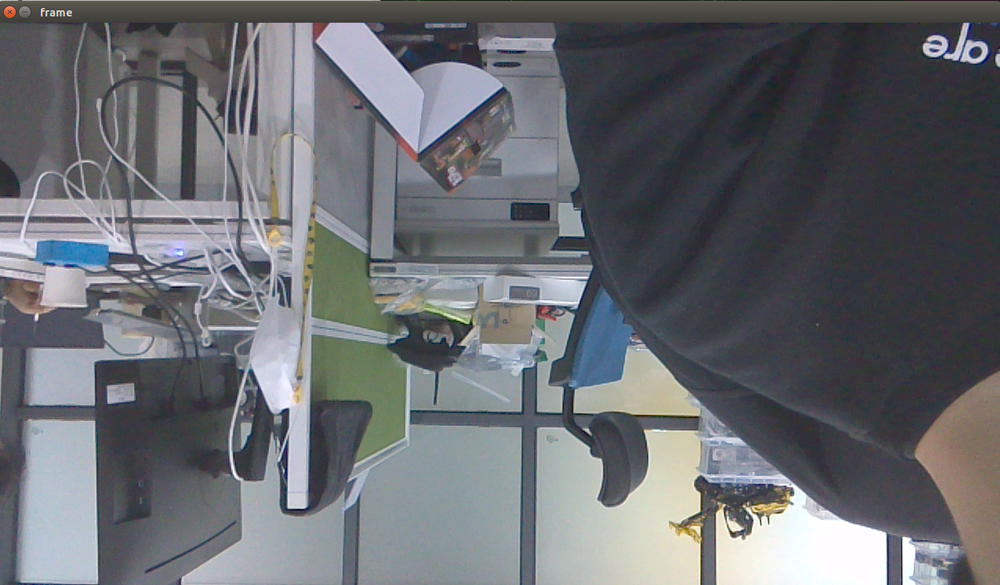

# 하드웨어 연결 확인하기

> SpiderCar의 전장부를 모두 조립하였다면, 제대로 연결을 완료하였는지 확인이 필요합니다.
> 

## 📢 모터드라이버 PCA9685 연결 확인

- 터미널을 열고 다음 커멘드 라인을 입력해주세요!!

```bash
$ i2cdetect -y -r 1
     0  1  2  3  4  5  6  7  8  9  a  b  c  d  e  f
00:          -- -- -- -- -- -- -- -- -- -- -- -- -- 
10: -- -- -- -- -- -- -- -- -- -- -- -- -- -- -- -- 
20: -- -- -- -- -- -- -- -- -- -- -- -- -- -- -- -- 
30: -- -- -- -- -- -- -- -- -- -- -- -- -- -- -- -- 
40: 40 -- -- -- -- -- -- -- -- -- -- -- -- -- -- -- 
50: -- -- -- -- -- -- -- -- -- -- -- -- -- -- -- -- 
60: -- -- -- -- -- -- -- -- -- -- -- -- -- -- -- -- 
70: 70 -- -- -- -- -- -- --
```

<aside>
💡 위와 같이 40과 70이 나타났다면 성공입니다!!

</aside>

## 📢 CSI 카메라 연결 확인

SpiderCar에 사용된 CSI 카메라는 일반 웹캠과 다르게 OpenCV 내에서 VideoCapture가 아닌, gstreamer 통해 접근해야 합니다. 이에 따라 연결의 확인과 동작 여부 확인이 반드시 필요합니다.

- **SpiderCar** 폴더인 `hello-mars-spidercar` 안에 **utils**로 진입하여 다음과 같이 테스트 프로그램을 실행합니다.

```bash
python3 csi_cam_test.py
```

<p align="center">
    
</p>

<aside>
💡 실행 시 다음과 같이 화면이 보였다면 정상 연결한 것입니다. (위아래가 뒤집혔지만 연결만을 확인하므로 큰 문제는 없습니다.)

</aside>

## 📢 RC카 제어 확인

- **SpiderCar** 폴더인 `hello-mars-spidercar` 안에 **RCController**로 진입하여 다음과 같이 테스트 프로그램을 실행합니다.

```bash
$ python3 basic_control.py 

Throttle Controller Awaked!!
Steering Controller Awaked!!
Throttle : 360
Angle : 350
speed_pulse : 360 / steering_pulse : 350
```

전후 엑셀 값과 좌우 조향값을 각각 입력받아 RC카의 제어가 가능합니다.

이를 통해 영점 조절을 할 수도 있지만, 여러 시행착오가 필요하기에 핸드폰을 이용한 영점조절 방식을 추천드립니다.

## 📢 센서 동작 확인

 

현재 지원하는 센서의 종류는 두가지가 있습니다.

- 적외선 센서
- 자석 센서

각각 센서의 활용 예시는 사진과 같이 별도 폴더로 나뉘어 있습니다. 


<p align="center">
    
</p>

두 예제 모두 예시 파일을 담고 있으며 여기서는 **자석 센서의 예시를 실행**해보도록 하겠습니다.

```bash
$ cd hello-mars-spidercar/HallSensor
$ python3 hall_sensor.py 

/usr/lib/python3/dist-packages/Jetson/GPIO/gpio.py:411: RuntimeWarning: No channels have been set up yet - nothing to clean up! Try cleaning up at the end of your program instead!
  "program instead!", RuntimeWarning)
/usr/lib/python3/dist-packages/Jetson/GPIO/gpio.py:386: RuntimeWarning: This channel is already in use, continuing anyway. Use GPIO.setwarnings(False) to disable warnings
  RuntimeWarning)
1637721326.3569725
1637721326.357085
1637721326.3571954
1637721326.3573055
1637721326.3574166
1637721326.357528
1637721326.3576384
1637721326.3577476
1637721326.3578575
1637721326.3579745
1637721326.3580956
1637721326.3582077
1637721326.358321
...
```

예제를 실행시킨 뒤 센서에 자석을 접촉하여 센서가 반응하면 위 로그와 같이 현재 시간이 출력되어 나타납니다.